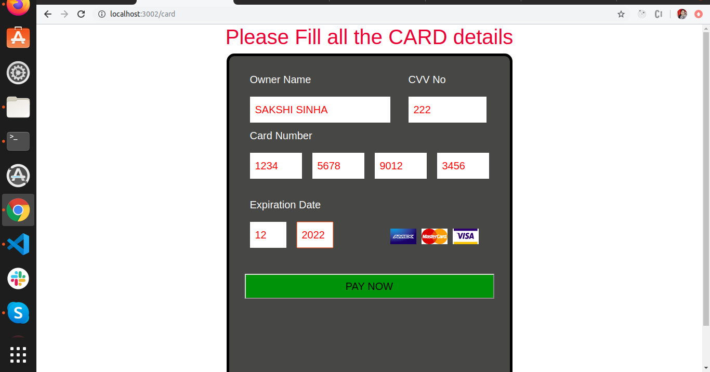

## Credit Card Input Component

### CREDIT CARD 


## Features:
* User must be able to paste not more than **N** digit number which must be equally divided into **I** input fields.
* On pasting from the clipboard, the last input field should get in focus.
* After adding **N** digits the focus should automatically move to the next input box. Same should happen during deletion.
* The input field must be keyboard accessible.

## Setup

```
npm install
```

```
npm start
```
